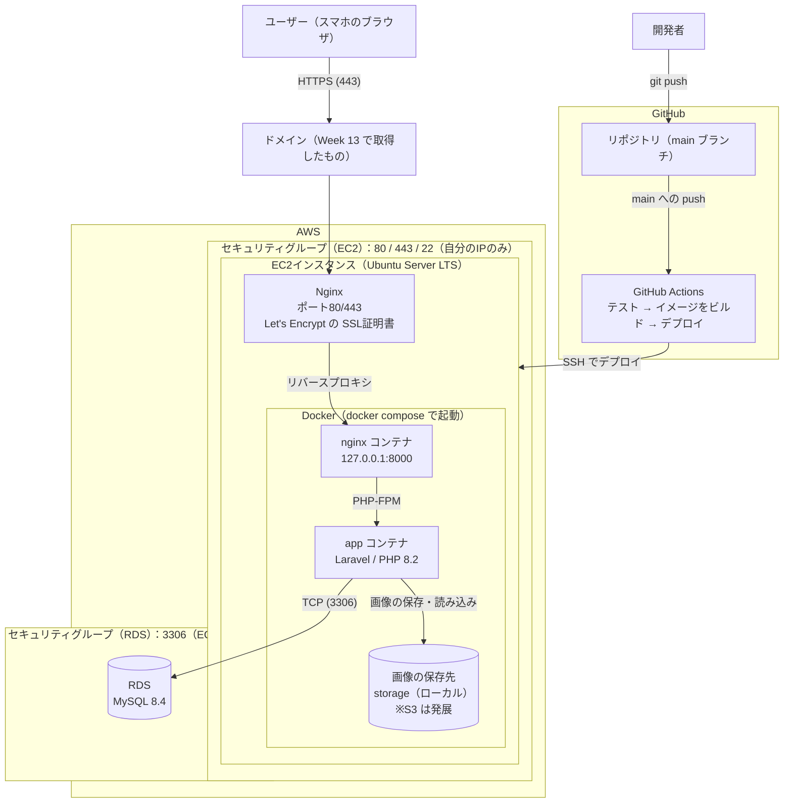

```mermaid
flowchart TB
  user["ユーザー（スマホのブラウザ）"]
  dev["開発者"]
  dns["ドメイン（Week 13 で取得したもの）"]

  subgraph AWS["AWS"]
    subgraph SG_EC2["セキュリティグループ（EC2）：80 / 443 / 22（自分のIPのみ）"]
      subgraph EC2["EC2インスタンス（Ubuntu Server LTS）"]
        hostnginx["Nginx<br/>ポート80/443<br/>Let's Encrypt の SSL証明書"]
        subgraph Docker["Docker（docker compose で起動）"]
          nginxc["nginx コンテナ<br/>127.0.0.1:8000"]
          app["app コンテナ<br/>Laravel / PHP 8.2"]
          storage[("画像の保存先<br/>storage（ローカル）<br/>※S3 は発展")]
        end
      end
    end
    subgraph SG_RDS["セキュリティグループ（RDS）：3306（EC2からのみ）"]
      rds[("RDS<br/>MySQL 8.4")]
    end
  end

  subgraph GitHub["GitHub"]
    repo["リポジトリ（main ブランチ）"]
    actions["GitHub Actions<br/>テスト → イメージをビルド → デプロイ"]
  end

  user -->|"HTTPS (443)"| dns
  dns --> hostnginx
  hostnginx -->|"リバースプロキシ"| nginxc
  nginxc -->|"PHP-FPM"| app
  app -->|"TCP (3306)"| rds
  app -->|"画像の保存・読み込み"| storage
  dev -->|"git push"| repo
  repo -->|"main への push"| actions
  actions -->|"SSH でデプロイ"| EC2
```